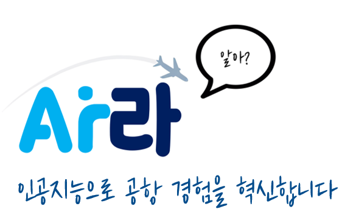
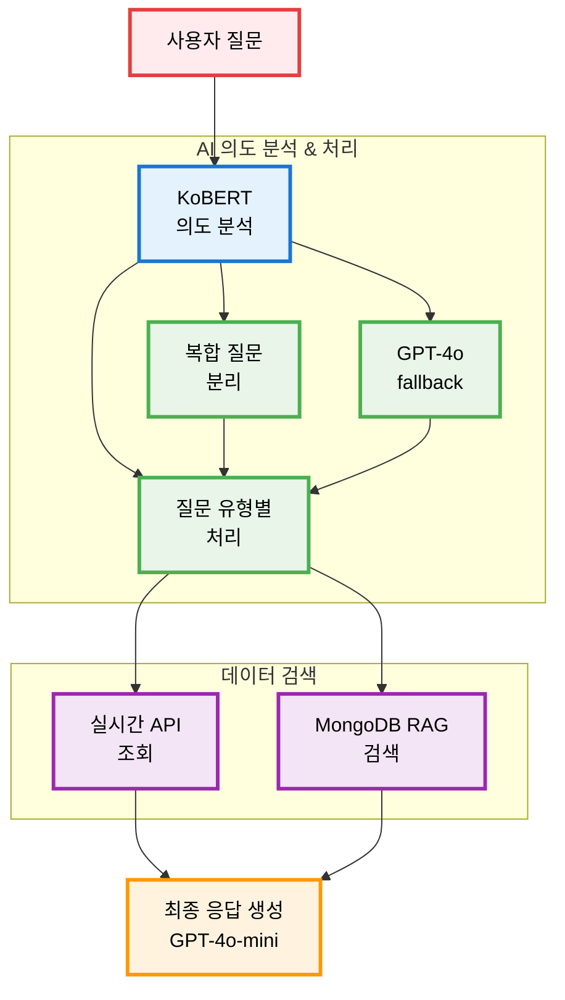

# 🛫 인천공항 챗봇 "아라" - AI 기반 스마트 공항 시스템

<div align="center">
  


**Airport + AI = 아라**  
*인공지능으로 공항 경험을 혁신합니다*

[](##)
[](##)

</div>

---

## 🚀 프로젝트 개요

**"아라"는 한국공항공사(KAC) 생성형 AI 기반 고객상담 챗봇 고도화 사업에서 영감을 받아 개발된 인천공항 AI 챗봇 서비스입니다.**

- 🧠 **AI 기반 의도 분석**: KoBERT 모델을 활용한 99.7% 정확도의 의도 인식
- ⚡ **실시간 데이터 연동**: 공공데이터 API 실시간 조회로 최신 정보 제공
- 🎯 **복합 질문 처리**: 기존 키워드 매칭 방식을 넘어선 맥락적 이해
- 💬 **자연스러운 대화**: GPT-4o-mini 기반 공항 직원 페르소나 적용

---

## 🤖 핵심 AI 기술

### 🧬 AI 아키텍처


### 🎯 AI 성능 지표
- **의도 인식 정확도**: 99.7% (5,396개 공항 질문 데이터 학습)
- **지원 의도 카테고리**: 17개 (항공편, 주차장, 시설, 날씨 등)
- **실시간 데이터 연동**: 공공데이터포털 API

---

## 🏗️ 시스템 아키텍처


```
🌐 사용자 인터페이스
┌─────────────────┐
│   웹 브라우저    │
│ - 실시간 채팅    │
└─────────┬───────┘
          │ 
          ▼
📱 프론트엔드 서버 (Next.js)
┌─────────────────────────────┐
│ • Server-Side Rendering     │
│ • WebSocket 실시간 통신       │
└─────────────┬───────────────┘
              │ REST API
              ▼
🖥️ 백엔드 서버 (Spring Boot)
┌──────────────────────────────────────┐
│ • JWT + OAuth 2.0 인증                │ 
│ • PostgreSQL (사용자/세션)             │  
│ • MongoDB (채팅 메시지)                │
│ • Redis (토큰 캐시)                    │
└─────────────┬────────────────────────┘
              │ API 호출
              ▼
🤖 AI 서버 (Django + Gunicorn + Nginx)
┌─────────────────────────────────────┐
│ 🧠 KoBERT (의도 분석)                │
│ 💬 GPT-4o-mini (응답 생성)           │
│ 🔍 MongoDB Vector Search (RAG)      │
│ ⚡ Django Redis Cache                │
└─────────────┬───────────────────────┘
              │
  ┌───────────┴────────────────────────────────┐
  ▼                                           ▼
🌐 실시간 API 연동                         📚 MongoDB RAG DB
┌─────────────────┐                   ┌──────────────────┐
│ • 공공데이터포털   │                  │ • 공항 정책 문서    │
│ • 기상청 API     │                   │ • 시설 정보        │
└─────────────────┘                   │ • 벡터 임베딩      │    
                                      │ • 유사도 검색      │
                                      └──────────────────┘

☁️ Azure Cloud Platform
Docker + Azure DevOps CI/CD
```


---

## ✨ 주요 기능

### 🛬 실시간 항공편 정보
- 항공편명으로 한눈에 조회 (예: "KE077 언제 출발해?")
- 실시간 출발/도착 항공편 현황
- 게이트 정보 및 터미널 안내

### 🅿️ 주차장 실시간 현황
- T1/T2 터미널별 주차 가능 대수
- 주차 요금 정책 및 할인 혜택 안내
- 주차장 위치 및 접근 경로

### 🧳 수하물 정책 & 수취대
- 항공사별 기내/위탁 수하물 규정
- 실시간 수하물 수취대 정보

### 🌤️ 날씨 & 편의시설
- 인천공항 실시간 날씨 정보
- 공항 내 편의시설 위치 안내
- 쇼핑, 식당, 라운지 정보

---

## 🛠️ 기술 스택

### Frontend
- **Next.js 15**: Server-Side Rendering
- **React 18**: 컴포넌트 기반 UI
- **WebSocket/STOMP**: 실시간 채팅 통신
- **Docker**: 컨테이너화 배포

### Backend  
- **Spring Boot**: RESTful API 서버
- **PostgreSQL**: 사용자 데이터 관리
- **MongoDB**: 채팅 메시지 저장
- **JWT + OAuth 2.0**: Google 로그인 연동
- **Redis**: JWT 토큰 캐시 관리

### AI Server
- **Django**: AI 서버 프레임워크  
- **KoBERT**: 한국어 특화 의도 분석
- **GPT-4o-mini**: 자연스러운 응답 생성
- **MongoDB Vector Search**: RAG 기반 지식 검색
- **Gunicorn + Nginx**: 고성능 서버 구성

### Infrastructure
- **Azure Cloud**: 클라우드 기반 배포
- **Azure DevOps**: CI/CD 파이프라인

---

## 📊 성능 

### AI 모델 성능
- **의도 분석 정확도**: 99.7%
- **학습 데이터**: 5,396개 공항 관련 질의응답
- **지원 언어**: 한국어 
  
---

## 🌟 기존 서비스와의 차별점

| 구분 | 기존 인천공항 챗봇 | 🆕 아라(Ara) |
|------|------------------|-------------|
| **처리 방식** | 키워드 매칭 | **AI 의도 분석** |
| **복합 질문** | ❌ 처리 불가 | ✅ **맥락적 이해** |
| **실시간 정보** | ❌ 정적 데이터 | ✅ **실시간 API 연동** |
| **대화 기억** | ❌ 없음 | ✅ **대화 맥락 유지** |
| **응답 방식** | 웹사이트 링크 | ✅ **직접 답변 제공** |